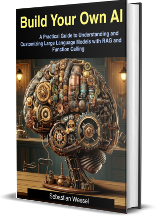

# BuildOwn.AI Buddy

**BuildOwn.AI Buddy** is a demonstration application showcasing how to build an AI-driven solution in TypeScript, leveraging **Ollama** for serving large language models.

https://github.com/user-attachments/assets/f6d700f0-ab9b-4154-bf51-d22f0f18bf25

|   |   |
|---|---|
| The comprehensive and detailed explaination can be found in the book **Build Your Own AI**. |  |
| [BuildOwn.AI](https://buildown.ai) | [Get The Book](https://buildown.ai/book/buy) |

**Copyright: Sebastian Wessel, [License](./LICENSE.md)**
